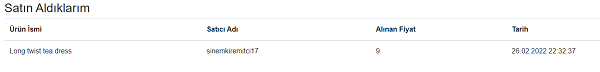

# 163 UNLU&CO & Patika.Dev .NET Bootcamp Bitirme Projesi
___

## Genel Bakış
Bu Proje 163. Unlu&Co & Patika.Dev .Net Bootcamp sonunda verilen **Ürün/Katalog** projesini içermektedir.

 Kullanıcılar siteye girerek anasayfadaki ürünlerin tamamını görebilir, ürün detaylarına gidebilir veya kategori seçerek ilgili kategorilerdeki ürünlere ulaşabilir. Bunun dışında giriş yapmadan yapabileceği işlemler siteye kayıt, giriş işlemleri ile sınırlıdır.

Kayıt sayfasında girilen bilgiler hem frontend form ile hem de ***Fluent Validation*** ile doğrulanmaktadır. Kontrol edilen bilgiler içerisinde email adresinin doğruluğu, şifre uzunluğu ve karmaşıklık düzeyi, girilen diğer bilgilerin varlığı ve uzunluğu gibi kriterler yer almaktadır. Girilen bilgilerde hata varsa kullanıcı bilgilendirilmekte, kayıt başarılı ise şifreler hashlenerek saklanmaktadır. Aynı şifrelere sahip kullanıcıların şifreleri birbirleri ile aynı olmamaktadır. 

Kayıt sonrası kullanıcının mail adresine async olarak entegre edilen ***SMTP*** protokolü ve ***Hangfire*** servisi yardımıyla hoşgeldin mailleri kuyruğa eklenerek gönderilmektedir. Mail gönderimi başarısız olması halinde **5** defa gönderilmeye çalışılmakta, başarısız olması durumunda hangfire servisine ait veritabanında statusu başarısız olarak saklanmaktadır. Gönderilen maillerin statuleri başarılı olarak kaydedilmektedir.

Üye girişi esnasında mail adresi ve şifre ayrı ayrı kontrol edilmekte, oluşan hatalarda kullanıcıya bilgi verilmektedir. 3 kez parolanın hatalı girilmesi durumunda **kullanıcı hesabı 24 saatliğine bloke edilmektedir.** İşlemin başarılı olması halinde ***LocalStorage*** da saklanmak üzere bir ***JWT TOKEN*** üretilmektedir. Bu token, yapılan sorguların tamamında header'a entegre edilerek server tarafına gönderilmektedir.

Kategoriler eklenebilmekte ve güncellenebilmektedir. Ürünlerin listelendiği sayfada varsayılan olarak tüm kategorilerin ürünleri çekilmekte, kategori seçimi ile istenilen kategoriye ait ürünler getirilmektedir. ***Filtreleme*** ve ***Sayfalama*** yöntemleri ile verilerin tamamının çekilmesi engellenmektedir.

Ürünler için tanımlanan ***IsOfferable*** değişkeni sayesinde teklife açık ürünlere teklif verilebilmekte, verilen teklifin tutarı gerek yüzdelik olarak, gerekse elle girilerek ayarlanabilmektedir. Verilen teklifler ***güncellenebilmekte ve geri çekilebilmektedir.*** Direk satın alınan ürünlerin ***IsSold*** opsiyonu aktif edilmekte ve bu ürüne teklif alımı ve satışı durdurulmaktadır. 

Ürün teklifleri için 3 adet statu belirlenmiştir. Bu statuler : ***BEKLEMEDE, KABUL EDİLDİ, REDDEDİLDİ*** olarak ayrılmıştır. Verilen tekliflerin oluşturulma durumu BEKLEMEDE olarak ayarlanmıştır. Satıcının ***ONAY*** vermesi akabinde bu statu KABUL EDİLDİ olarak güncellenmekte, ***REDDET***mesi halinde ise REDDEDİLDİ olarak girilmektedir. Teklifi onaylanan alıcılar ***BU FİYATTAN AL*** seçeneği ile ürünü satın alabilmektedir.

Ürün ekleme sayfasında bulunan formda validasyonlar istenilen ölçütlerde yapılmakta, resimler için ***MAX BOYUT 400KB*** olarak değerlendirilmektedir.
___
## Kullanılan Yöntem ve Teknolojiler
* ***.NET 5.0 Web API***
 * ***Entity Framework***
 * ***Blazor***
 * ***Microsoft SQL Triggers & Stored Procedures***
 * ***Hangfire***
 * ***Automapper***
 * ***Fluent Validation***
 * ***Identity & JWT Bearer Tokens***
 * ***Onion Architecture***
 * ***SOLID Principles***
 * ***Repository Pattern & Unit of Work***
 * ***SMTP EMail Services***
 
___

## Projeyi Geliştirici Ortamında Çalıştırmak İçin

### Ön Gereksinimler
* Visual Studio 2019+
* Microsoft SQL Server 2017+
* .Net 5.0

### Çalıştırılması
Local klasöre projeyi klonlamak için :
```
 git clone https://github.com/Patika-dev-Unlu-Co-Net-Bootcamp/AliGulmen.UnluCoProject.UrunKatalog.git
```
Projeyi build ederek gerekli veritabanları aşağıdaki komut ile oluşturulabilir.
```
 update-database
```
Ayrıca, hangfire kullanımı için ***HangfireDev*** adında boş bir veritabanı oluşturmak yeterli olacaktır.
Blazor ile hazırlanmış arayüze erişmek için;
```
http://localhost:5000
```

Swagger sayfasına ulaşmak için ise : 
```
http://localhost:3000
```
adresine erişmek yeterlidir.

## Ekran Görüntüleri





